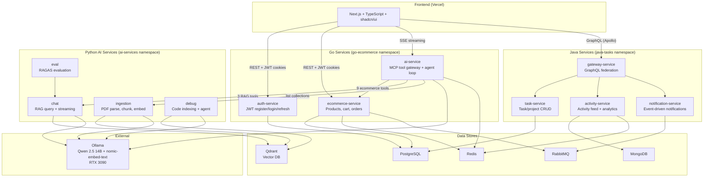
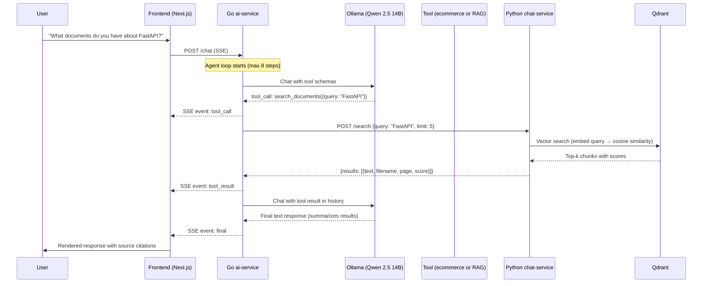
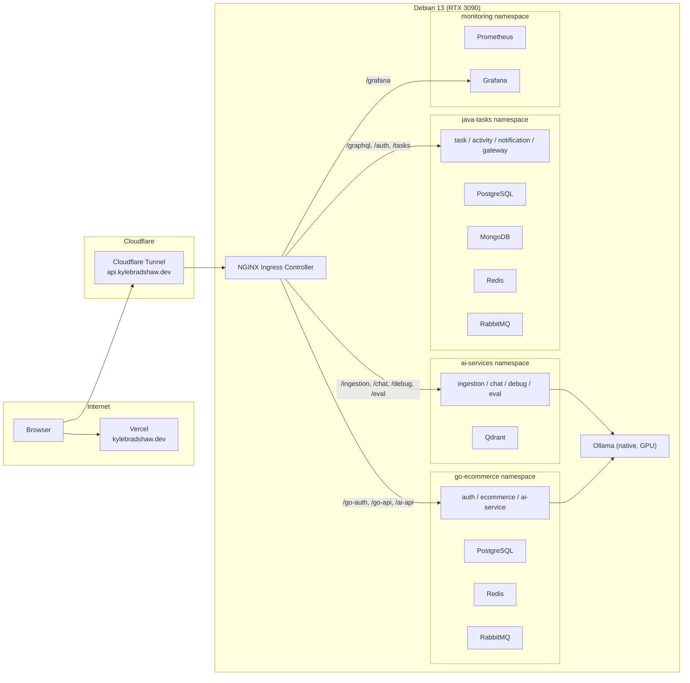

# System Architecture Documentation — Implementation Plan

> **For agentic workers:** REQUIRED SUB-SKILL: Use superpowers:subagent-driven-development (recommended) or superpowers:executing-plans to implement this plan task-by-task. Steps use checkbox (`- [ ]`) syntax for tracking.

**Goal:** Create `docs/architecture.md` (interview prep) and update CLAUDE.md with AI platform context for agents.

**Architecture:** Two documentation files — no code changes. The architecture doc has three sections (system overview, AI platform deep dive, infrastructure) with three Mermaid diagrams. The CLAUDE.md update adds a focused "AI Platform Architecture" section after "Project Structure".

**Tech Stack:** Markdown, Mermaid diagrams

---

### Task 1: Create system overview section with service map diagram

**Files:**
- Create: `docs/architecture.md`

- [ ] **Step 1: Write the system overview and service map**

Create `docs/architecture.md` with the following content:

````markdown
# System Architecture

## 1. System Overview

A polyglot, production-style portfolio demonstrating RAG architecture, agentic AI, and microservice design through three backend stacks (Go, Java, Python) with a Next.js frontend — deployed on Kubernetes with full observability.

### Service Map



### Frontend Integration

The frontend uses three distinct API patterns to match each backend stack:

| Backend | Protocol | Client | Auth |
|---------|----------|--------|------|
| Go auth/ecommerce | REST | `fetch` with auto-refresh (`frontend/src/lib/go-api.ts`) | JWT in httpOnly cookies |
| Java gateway | GraphQL | Apollo Client (`frontend/src/lib/apollo-client.ts`) | JWT in httpOnly cookies |
| Go ai-service | SSE | Custom SSE parser (`frontend/src/lib/ai-service.ts`) | JWT in httpOnly cookies |
````

- [ ] **Step 2: Verify Mermaid renders**

Run: `cat docs/architecture.md | head -5`
Expected: File exists with `# System Architecture` header. Mermaid rendering will be verified on GitHub after push.

- [ ] **Step 3: Commit**

```bash
git add docs/architecture.md
git commit -m "docs: add system architecture overview with service map diagram"
```

---

### Task 2: Write AI platform deep dive — tool gateway and RAG pipeline

**Files:**
- Modify: `docs/architecture.md`

- [ ] **Step 1: Append section 2.1 (MCP Tool Gateway) and 2.2 (RAG Pipeline)**

Append to `docs/architecture.md`:

````markdown

## 2. AI Platform Deep Dive

### 2.1 The MCP Tool Gateway (Go ai-service)

The Go ai-service is the single entry point for all AI functionality. It exposes a `/chat` endpoint that accepts natural language, runs an agent loop over Ollama's tool-calling API, and streams results back as Server-Sent Events.

**Tool Registry**

Tools implement a four-method interface (`Name`, `Description`, `Schema`, `Call`) and register into an in-memory `MemRegistry` at startup (`go/ai-service/internal/tools/registry.go`). The registry provides tool schemas to Ollama for function-calling and dispatches calls by name.

12 built-in tools:

| Tool | Purpose | Auth Required | Cache TTL |
|------|---------|:---:|:---:|
| `search_products` | Free-text product catalog search | No | 60s |
| `get_product` | Fetch product details by ID | No | 60s |
| `check_inventory` | Check stock status | No | 10s |
| `list_orders` | List user's orders | Yes | 10s |
| `get_order` | Fetch single order | Yes | — |
| `summarize_orders` | LLM summary of recent orders | Yes | — |
| `view_cart` | Get shopping cart contents | Yes | — |
| `add_to_cart` | Add product with quantity | Yes | — |
| `initiate_return` | Create return for order items | Yes | — |
| `search_documents` | Semantic search over RAG docs | No | 30s |
| `ask_document` | Ask question against RAG docs | No | — |
| `list_collections` | List available document collections | No | 60s |

The `Cached()` decorator (`tools/cached.go`) wraps any tool with Redis caching. Cache keys are SHA256 hashes of `toolName + canonicalJSON(args) + userID`.

**Agent Loop (ReAct Pattern)**

Implemented in `Agent.Run()` (`go/ai-service/internal/agent/agent.go`):

1. Send message history + all tool schemas to Ollama
2. If Ollama returns a final text response → emit `FinalEvent`, done
3. If Ollama returns tool calls → execute each tool via registry lookup
4. Feed tool results back into message history
5. Repeat (max 8 steps, 90-second timeout)

Each tool execution uses `safeCall()` to recover from panics. Refusal detection via guardrails flags inappropriate requests.

**Resilience**

- **Circuit breakers** on all external HTTP calls (ecommerce API, Python services, Ollama)
- **Redis caching** with fail-open behavior — cache misses or Redis errors don't block tool execution
- **Rate limiting** — 20 requests/min per IP on POST /chat, Redis-backed fixed-window

### 2.2 RAG Pipeline (Python Services)

Four Python FastAPI services handle the RAG lifecycle:

**Ingestion** (`services/ingestion/`) — document processing pipeline:

1. PDF uploaded via POST /ingest
2. `pdf_parser.py` extracts text per page
3. `chunker.py` splits with LangChain `RecursiveCharacterTextSplitter` (1000 tokens, 200 token overlap)
4. `embedder.py` embeds each chunk with nomic-embed-text (768-dimensional vectors)
5. `store.py` upserts to Qdrant with COSINE distance scoring

Multi-collection support allows organizing documents by topic. Per-document UUID tracking enables clean deletion.

**Chat** (`services/chat/`) — RAG query pipeline:

1. Question arrives via POST /chat or POST /search
2. Question embedded with same nomic-embed-text model
3. Qdrant top-k vector search retrieves relevant chunks
4. Source metadata collected (filename, page number)
5. RAG prompt assembled: system instructions + retrieved chunks + question
6. Ollama generates response, streamed back as SSE

POST /search returns raw chunks without generation — used by the Go ai-service's `search_documents` tool.

**Debug** (`services/debug/`) — code-aware debugging agent:

1. POST /index walks Python files, chunks with `RecursiveCharacterTextSplitter.from_language(Language.PYTHON)` (1500 chars, 200 overlap), stores file paths + line numbers in Qdrant
2. POST /debug runs an agent loop (up to 10 iterations) with tools for file search, grep, and test execution
3. Security: project paths validated against an allowlist

**Eval** (`services/eval/`) — RAG quality measurement:

1. Create evaluation datasets with questions + expected answers
2. POST /evaluations queries the chat service for each question, collects responses + retrieved chunks
3. Runs RAGAS metrics: AnswerRelevancy, ContextPrecision, ContextRecall, Faithfulness
4. Stores aggregate and per-query scores in SQLite

All Python services share a common LLM factory (`services/shared/llm/`) supporting Ollama, OpenAI, and Anthropic providers via protocol-based interfaces.
````

- [ ] **Step 2: Commit**

```bash
git add docs/architecture.md
git commit -m "docs: add AI platform deep dive — tool gateway and RAG pipeline"
```

---

### Task 3: Write MCP-RAG bridge, end-to-end data flow, and observability sections

**Files:**
- Modify: `docs/architecture.md`

- [ ] **Step 1: Append sections 2.3, 2.4, and 2.5**

Append to `docs/architecture.md`:

````markdown

### 2.3 MCP-RAG Bridge

The Go ai-service wraps the Python chat and ingestion services as three MCP tools, creating a bridge between the agentic Go layer and the RAG Python layer.

`RAGClient` (`go/ai-service/internal/tools/clients/rag.go`) makes three HTTP calls:

| Tool | Python Endpoint | Method | What it does |
|------|----------------|--------|-------------|
| `search_documents` | chat-service `/search` | POST | Semantic search, returns chunks with scores |
| `ask_document` | chat-service `/chat` | POST | Full RAG generation with sources |
| `list_collections` | ingestion-service `/collections` | GET | Lists available document collections |

Design decisions:
- **30-second HTTP timeout** (vs 5s for ecommerce) — RAG responses involve LLM generation
- **Circuit breaker** via `resilience.Call` — fails fast when Python services are down
- **OTel trace propagation** via `otelhttp.NewTransport()` — traces flow from Go through Python to Qdrant/Ollama
- **Selective caching** — `search_documents` cached 30s, `list_collections` cached 60s, `ask_document` never cached (each generation is unique)

### 2.4 End-to-End Data Flow



**SSE Event Format**

The Go ai-service streams events from `internal/http/chat.go`:

```
event: tool_call
data: {"name": "search_documents", "args": {"query": "FastAPI"}}

event: tool_result
data: {"name": "search_documents", "display": {"results": [...]}}

event: final
data: {"text": "I found several documents about FastAPI..."}
```

The frontend SSE parser (`frontend/src/lib/ai-service.ts`) yields typed events (`ToolCallEvent`, `ToolResultEvent`, `FinalEvent`, `ErrorEvent`) that the UI renders inline — tool calls show what the agent is doing, results show evidence, and the final response synthesizes everything.

### 2.5 Observability

**Structured Logging**

Go ai-service uses `slog` with structured fields for every agent turn:
```
level=INFO msg="agent turn" turn_id=abc123 user_id=user1 steps=3 tools_called=["search_documents","ask_document"] duration_ms=4521 outcome=final
```
Outcomes: `final` (success), `refused` (guardrail triggered), `error` (infrastructure failure), `max_steps` (hit 8-step limit).

Python services use structlog with request middleware for correlated logging.

**OpenTelemetry Tracing**

Trace spans form a hierarchy across services:
```
agent.turn (Go)
├── agent.llm_call (Go → Ollama)
│   └── ollama.chat (Ollama)
├── agent.tool_call: search_documents (Go)
│   └── HTTP POST /search (Go → Python)
│       ├── embed query (Python → Ollama)
│       └── qdrant search (Python → Qdrant)
├── agent.llm_call (Go → Ollama, with tool results)
│   └── ollama.chat (Ollama)
└── ... (repeat until final)
```

Traces propagate across service boundaries via `otelhttp` transport wrappers in Go and OpenTelemetry middleware in Python.

**Prometheus Metrics**

| Metric | Type | Labels |
|--------|------|--------|
| `ai_agent_turns_total` | Counter | outcome |
| `ai_agent_steps_per_turn` | Histogram | — |
| `ai_agent_turn_duration_seconds` | Histogram | — |
| `ai_tool_calls_total` | Counter | name, outcome |
| `ai_tool_duration_seconds` | Histogram | name |
| `ai_cache_events_total` | Counter | type (hit/miss) |
| `ollama_request_duration_seconds` | Histogram | model, operation |
| `ollama_tokens_total` | Counter | model, type (prompt/completion) |
````

- [ ] **Step 2: Commit**

```bash
git add docs/architecture.md
git commit -m "docs: add MCP-RAG bridge, data flow sequence diagram, and observability"
```

---

### Task 4: Write infrastructure section

**Files:**
- Modify: `docs/architecture.md`

- [ ] **Step 1: Append section 3 (Infrastructure)**

Append to `docs/architecture.md`:

````markdown

## 3. Infrastructure



All services run in Minikube on a Debian 13 server with an RTX 3090 GPU. Ollama runs natively (not in K8s) for direct GPU access, reached from pods via `host.minikube.internal`.

**Routing:** NGINX Ingress Controller routes all traffic by URL path. Cloudflare Tunnel exposes `api.kylebradshaw.dev` → Minikube Ingress. The frontend on Vercel calls the API domain directly.

**QA environment:** Parallel namespaces (`ai-services-qa`, `java-tasks-qa`, `go-ecommerce-qa`) mirror production with shared infrastructure. QA frontend deployed to `qa.kylebradshaw.dev` on Vercel.

**CI/CD:** GitHub Actions (`.github/workflows/ci.yml`) — PRs to `qa` trigger quality checks; pushes to `qa` build + deploy to QA; pushes to `main` build + deploy to production. Images pushed to GHCR, deployed via SSH to the Debian server using `kubectl apply` with Kustomize overlays.

For full deployment architecture details, see [`docs/adr/deployment-architecture.md`](adr/deployment-architecture.md).
````

- [ ] **Step 2: Commit**

```bash
git add docs/architecture.md
git commit -m "docs: add infrastructure section with K8s namespace diagram"
```

---

### Task 5: Update CLAUDE.md with AI Platform Architecture section

**Files:**
- Modify: `CLAUDE.md` (insert after line 119, before "Kyle's Background")

- [ ] **Step 1: Add AI Platform Architecture section**

Insert the following after the closing `` ``` `` of the Project Structure section (line 119) and before `## Kyle's Background` (line 121):

```markdown

## AI Platform Architecture

The Go ai-service (`go/ai-service/`) is the MCP gateway for all AI functionality. It fronts 9 ecommerce tools and 3 RAG tools through a unified agent loop.

- **Tool registry:** 12 built-in tools in `go/ai-service/internal/tools/`, registered in `main.go`. Interface: Name/Description/Schema/Call. Cached via Redis wrapper (`tools/cached.go`).
- **Agent loop:** ReAct pattern in `go/ai-service/internal/agent/agent.go`. 8 steps max, 90s timeout. Streams SSE events (tool_call, tool_result, tool_error, final, error) from `internal/http/chat.go`.
- **RAG bridge:** Go calls Python chat service at `/search` and `/chat`, ingestion service at `/collections`. Client in `go/ai-service/internal/tools/clients/rag.go`. 30s timeout, circuit breaker, OTel trace propagation.
- **Python services:** ingestion (PDF→chunk→embed→Qdrant), chat (embed→search→RAG prompt→stream), debug (code indexing + agent loop), eval (RAGAS metrics). Shared LLM factory in `services/shared/llm/`.
- **Key env vars:** `RAG_CHAT_URL`, `RAG_INGESTION_URL`, `OLLAMA_URL`, `REDIS_URL`, `ECOMMERCE_URL`.
- **Frontend integration:** POST /chat with SSE streaming. Frontend client in `frontend/src/lib/ai-service.ts` parses event types.
- **Roadmap (Q2 2026, issue #75):** Phase 1: architecture doc → Phase 2: unified AI assistant UI (#77) → Phase 3: Loki log aggregation (#78) → Phase 4a-c: RAG eval harness, hybrid search, cross-encoder re-ranking (#79-#81).
```

- [ ] **Step 2: Commit**

```bash
git add CLAUDE.md
git commit -m "docs: add AI Platform Architecture section to CLAUDE.md"
```

---

### Task 6: Final review and link from README

**Files:**
- Modify: `README.md` (add link to architecture doc)
- Read: `docs/architecture.md` (full review)

- [ ] **Step 1: Read the complete architecture doc and verify all three Mermaid diagrams are present**

Run: `grep -c '```mermaid' docs/architecture.md`
Expected: `3`

- [ ] **Step 2: Add link to architecture doc in README**

Find the documentation or project structure section in `README.md` and add a link:
```markdown
- [`docs/architecture.md`](docs/architecture.md) — System architecture overview and AI platform deep dive
```

- [ ] **Step 3: Commit**

```bash
git add README.md
git commit -m "docs: link architecture doc from README"
```

- [ ] **Step 4: Run preflight**

No code changes, but verify markdown is clean:
```bash
git diff main --stat
```
Expected: Only `docs/architecture.md`, `CLAUDE.md`, and `README.md` changed.
