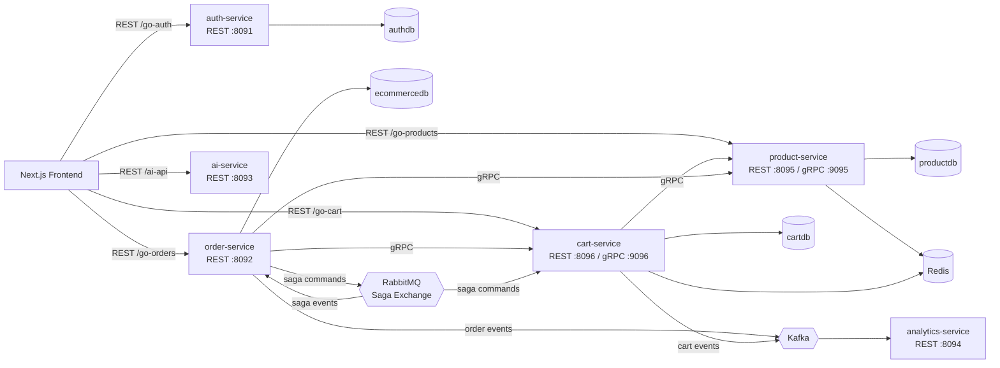
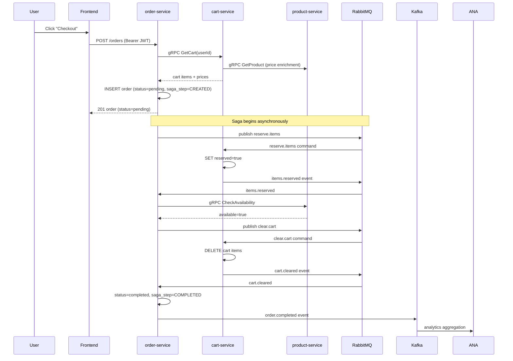

# /go Page Redesign — Microservices Architecture Showcase

## Context

The `/go` page (`frontend/src/app/go/page.tsx`) was written when the ecommerce platform was a monolith (auth + ecommerce, 2 services). Phase 1-3 of the decomposition is now complete: product-service, cart-service, and order-service are extracted with gRPC inter-service communication and a RabbitMQ saga orchestrator. The page needs to reflect the new architecture as the featured view, preserve the original content for comparison, and pull the AI assistant into its own standalone section.

## Design

### Page Structure

```
/go page
├── Bio section (updated: "six Go services")
├── "Ecommerce Platform" heading
├── Tab bar: [ Microservices (default) | Original ]
│   ├── Microservices tab
│   │   ├── "Why Decompose?" — portfolio-aware justification
│   │   ├── Tech Stack — badge/pill list
│   │   ├── Architecture — Mermaid diagram (6 services, gRPC, RabbitMQ, Kafka)
│   │   ├── Checkout Saga Flow — sequence diagram (happy path + compensation)
│   │   └── "What Changed" — 2x2 highlight cards
│   └── Original tab
│       ├── Old architecture description + Mermaid diagram
│       ├── Old checkout sequence diagram
│       └── Stress Testing & Scalability section
├── CTA buttons (View Store, Streaming Analytics)
└── AI Shopping Assistant (standalone section, below tabs)
    ├── Existing content (tool catalog, agent loop, product search flow)
    └── [Future spec will enhance this section]
```

### Tab Implementation

Use client-side React state (`useState`) for the tab toggle — no routing changes. The tab bar sits below the "Ecommerce Platform" heading. "Microservices" is the default active tab. The page must be converted to `"use client"` since the current page is a server component.

### Microservices Tab Content

**"Why Decompose?" section:**
Portfolio-aware tone: "I decomposed the monolithic ecommerce-service into three independent services to demonstrate service extraction patterns, gRPC inter-service communication, and saga-based distributed transactions — skills relevant to teams managing growing microservice architectures. Each service owns its own database, scales independently, and communicates through well-defined contracts."

**Tech Stack:**
Inline badge/pill format: 6 Go microservices, gRPC + Protobuf, RabbitMQ Saga, PostgreSQL (per-service), Redis, Kafka Analytics, Kubernetes + HPA, Prometheus + Jaeger.

**Architecture diagram (Mermaid):**


Short paragraph: "Six services communicate via REST (frontend-facing) and gRPC (inter-service). The checkout saga coordinates cart reservation, stock validation, and order completion through RabbitMQ command/event queues. Kafka streams analytics events to the analytics-service for real-time aggregation."

**Checkout Saga Flow (sequence diagram):**


Short paragraph below explaining the compensation path: if stock check fails at the CheckAvailability step, order-service publishes `release.items` to unreserve cart items, marks order as FAILED. Crash recovery on startup queries incomplete sagas and resumes from last known step.

**"What Changed" highlight cards (2x2 grid):**
1. **Database-per-Service** — Each service owns its database (productdb, cartdb, ecommercedb). No shared tables.
2. **gRPC Contracts** — Protobuf-defined service contracts with buf toolchain. Type-safe cross-service calls.
3. **Saga Orchestration** — RabbitMQ-based saga with compensation flows, DLQ, and crash recovery.
4. **Independent Scaling** — Each service has its own HPA, PDB, and resource limits. Scale what needs scaling.

### Original Tab Content

All current page content moves here unchanged:
- Old "Two Go services — auth and ecommerce" architecture description + Mermaid diagram
- Old synchronous checkout sequence diagram
- Stress Testing & Scalability section (table, fixes applied, k6 details)

Note: The AI Shopping Assistant does NOT go in this tab — it's now a standalone section.

### AI Shopping Assistant Section

Pulled out of the tabbed area into its own top-level section below the tabs and CTA buttons. Existing content preserved as-is:
- Overview paragraph
- Tool Catalog diagram
- Agent Loop flowchart
- Product search sequence diagram

No content changes — just relocated. A future spec will enhance this section with MCP, RAG bridge, and other additions.

### File Changes

| File | Change |
|------|--------|
| `frontend/src/app/go/page.tsx` | Rewrite: add `"use client"`, tab state, new Microservices tab content, move old content to Original tab, pull AI section out |

Single file change. No new components needed — the tab toggle is simple enough to inline with `useState`.

## Verification

- `npx tsc --noEmit` — no type errors
- `npm run lint` — no lint errors
- Visual check: both tabs render correctly, Mermaid diagrams load, AI section appears below tabs
- Tab switching works (client-side state, no page reload)
